# JUNGOL Solutions

| No. | Title | Difficulty | Solution |
|:---|:---|:---:|:---:|
| [00101](https://jungol.co.kr/problem/101) | 출력 - 형성평가1 |  | [C++](./00xxx/101.cpp) |
| [00501](https://jungol.co.kr/problem/501) | 출력 - 자가진단1 |  | [C++](./00xxx/501.cpp) |
| [00502](https://jungol.co.kr/problem/502) | 출력 - 자가진단2 |  | [C++](./00xxx/502.cpp) |
| [00503](https://jungol.co.kr/problem/503) | 출력 - 자가진단3 |  | [C++](./00xxx/503.cpp) |
| [00504](https://jungol.co.kr/problem/504) | 출력 - 자가진단4 |  | [C++](./00xxx/504.cpp) |
| [00505](https://jungol.co.kr/problem/505) | 출력 - 자가진단5 |  | [C++](./00xxx/505.cpp) |
| [01000](https://jungol.co.kr/problem/1000) | 두 정수 더하기 (A+B) |  | [C++](./01xxx/1000.cpp) |
| [01001](https://jungol.co.kr/problem/1001) | 강아지와 병아리 | 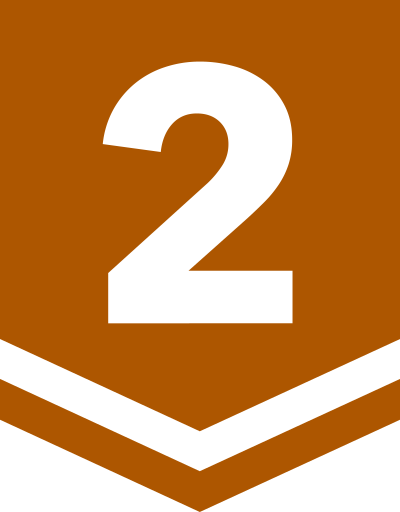 | [C++](./01xxx/1001.cpp) |
| [01002](https://jungol.co.kr/problem/1002) | 최대공약수, 최소공배수 | 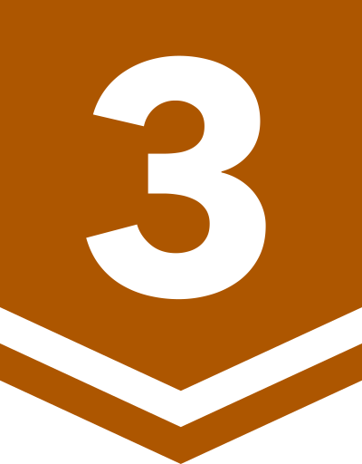 | [C++](./01xxx/1002.cpp) |
| [01054](https://jungol.co.kr/problem/1054) | 제곱근 | 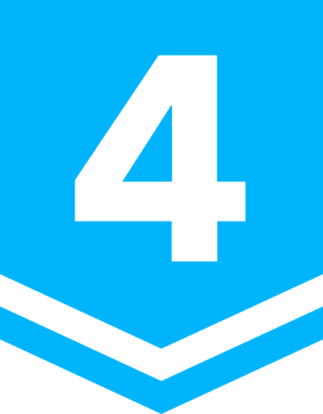 | [C++](./01xxx/1054.cpp) |
| [01060](https://jungol.co.kr/problem/1060) | 최소비용신장트리 | 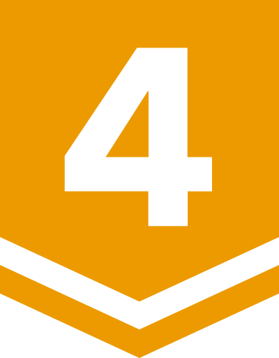 | [C++](./01xxx/1060.cpp) |
| [01112](https://jungol.co.kr/problem/1112) | 줄자접기 |  | [C++](./01xxx/1112.cpp) |
| [01182](https://jungol.co.kr/problem/1182) | 벽타기 |  | [C++](./01xxx/1182.cpp) |
| [01246](https://jungol.co.kr/problem/1246) | 성적 바꾸기 |  | [C++](./01xxx/1246.cpp) |
| [01291](https://jungol.co.kr/problem/1291) | 구구단 4 | 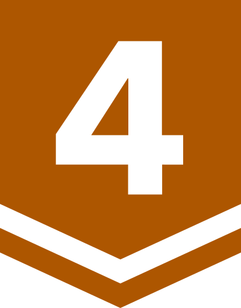 | [C++](./01xxx/1291.cpp) |
| [01341](https://jungol.co.kr/problem/1341) | 구구단 3 |  | [C++](./01xxx/1341.cpp) |
| [01350](https://jungol.co.kr/problem/1350) | 최대신장트리 |  | [C++](./01xxx/1350.cpp) |
| [01364](https://jungol.co.kr/problem/1364) | 방면적 넓히기(The Castle) | 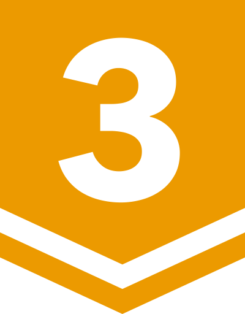 | [C++](./01xxx/1364.cpp) |
| [01514](https://jungol.co.kr/problem/1514) | 타일 채우기 |  | [C++](./01xxx/1514.cpp) |
| [01692](https://jungol.co.kr/problem/1692) | 곱셈 |  | [C++](./01xxx/1692.cpp) |
| [01776](https://jungol.co.kr/problem/1776) | 숫자 만들기 |  | [C++](./01xxx/1776.cpp) |
| [01798](https://jungol.co.kr/problem/1798) | 피자가게 |  | [C++](./01xxx/1798.cpp) |
| [01823](https://jungol.co.kr/problem/1823) | 정쌤의 문제내기3 |  | [C++](./01xxx/1823.cpp) |
| [01840](https://jungol.co.kr/problem/1840) | 치즈 |  | [C++](./01xxx/1840.cpp) |
| [01871](https://jungol.co.kr/problem/1871) | 줄세우기 |  | [C++](./01xxx/1871.cpp) |
| [01897](https://jungol.co.kr/problem/1897) | 자리배치0 | 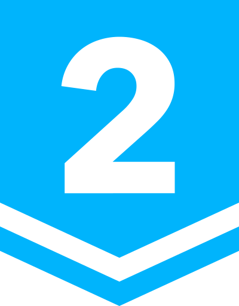 | [C++](./01xxx/1897.cpp) |
| [02107](https://jungol.co.kr/problem/2107) | 축구 |  | [C++](./02xxx/2107.cpp) |
| [02117](https://jungol.co.kr/problem/2117) | 야바위 |  | [C++](./02xxx/2117.cpp) |
| [02358](https://jungol.co.kr/problem/2358) | 트리의 중앙 |  | [C++](./02xxx/2358.cpp) |
| [02440](https://jungol.co.kr/problem/2440) | 설탕 배달(secer) | 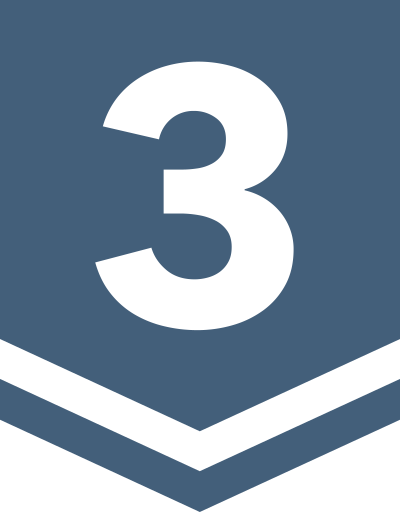 | [C++](./02xxx/2440.cpp) |
| [02736](https://jungol.co.kr/problem/2736) | 버블정렬(중) | 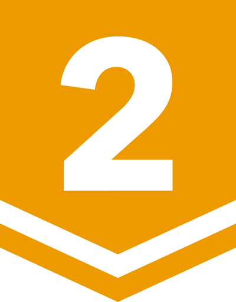 | [C++](./02xxx/2736.cpp) |
| [02859](https://jungol.co.kr/problem/2859) | 컬러볼 |  | [C++](./02xxx/2859.cpp) |
| [03018](https://jungol.co.kr/problem/3018) | 그래프 태우기 |  | [C++](./03xxx/3018.cpp) |
| [03230](https://jungol.co.kr/problem/3230) | 두 로봇 |  | [C++](./03xxx/3230.cpp) |
| [03288](https://jungol.co.kr/problem/3288) | 하노이2(4기둥-이동횟수만)(The Tower of Hanoi III) |  | [C++](./03xxx/3288.cpp) |
| [03334](https://jungol.co.kr/problem/3334) | 회문 |  | [C++](./03xxx/3334.cpp) |
| [03428](https://jungol.co.kr/problem/3428) | 등수 찾기(ranking) |  | [C++](./03xxx/3428.cpp) |
| [03669](https://jungol.co.kr/problem/3669) | 가장 먼 두 점 1 | 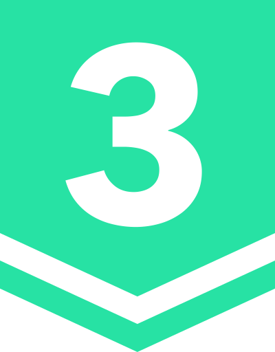 | [C++](./03xxx/3669.cpp) |
| [04053](https://jungol.co.kr/problem/4053) | MooTube |  | [C++](./04xxx/4053.cpp) |
| [04225](https://jungol.co.kr/problem/4225) | ax+by=1 |  | [C++](./04xxx/4225.cpp) |
| [04380](https://jungol.co.kr/problem/4380) | 피곤한 귀가길 |  | [C++](./04xxx/4380.cpp) |
| [04407](https://jungol.co.kr/problem/4407) | 아름다운 공원 |  | [C++](./04xxx/4407.cpp) |
| [04413](https://jungol.co.kr/problem/4413) | 이진 암호화 |  | [C++](./04xxx/4413.cpp) |
| [04827](https://jungol.co.kr/problem/4827) | 영업왕 명석이 (Time is Mooney) |  | [C++](./04xxx/4827.cpp) |
| [04993](https://jungol.co.kr/problem/4993) | 일진법 |  | [C++](./04xxx/4993.cpp) |
| [05038](https://jungol.co.kr/problem/5038) | 쇼핑몰 | 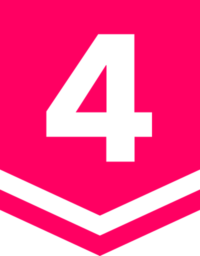 | [C++](./05xxx/5038.cpp) |
| [05043](https://jungol.co.kr/problem/5043) | 자습 |  | [C++](./05xxx/5043.cpp) |
| [05359](https://jungol.co.kr/problem/5359) | 학문 III (Acowdemia III) |  | [C++](./05xxx/5359.cpp) |
| [05377](https://jungol.co.kr/problem/5377) | 소는 풀을 좋아해 |  | [C++](./05xxx/5377.cpp) |
| [05461](https://jungol.co.kr/problem/5461) | 숫자구슬(medium) |  | [C++](./05xxx/5461.cpp) |
| [05513](https://jungol.co.kr/problem/5513) | 극장 좌석 배치 2 |  | [C++](./05xxx/5513.cpp) |
| [05539](https://jungol.co.kr/problem/5539) | 연구원과 실험 장비 (주식회사) |  | [C++](./05xxx/5539.cpp) |
| [05607](https://jungol.co.kr/problem/5607) | 피자먹고 기분 피자 |  | [C++](./05xxx/5607.cpp) |
| [05628](https://jungol.co.kr/problem/5628) | 반딧불이 |  | [C++](./05xxx/5628.cpp) |
| [05647](https://jungol.co.kr/problem/5647) | 크림빵 |  | [C++](./05xxx/5647.cpp) |
| [05683](https://jungol.co.kr/problem/5683) | 천사소년 서준이 |  | [C++](./05xxx/5683.cpp) |
| [05883](https://jungol.co.kr/problem/5883) | 팬케이크 |  | [C++](./05xxx/5883.cpp) |
| [05930](https://jungol.co.kr/problem/5930) | 슬픔을 나누면 2 |  | [C++](./05xxx/5930.cpp) |
| [05937](https://jungol.co.kr/problem/5937) | 두 상단 |  | [C++](./05xxx/5937.cpp) |
| [06070](https://jungol.co.kr/problem/6070) | 사탕 지팡이 축제 | 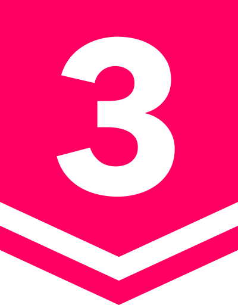 | [C++](./06xxx/6070.cpp) |
| [06326](https://jungol.co.kr/problem/6326) | 백열등 2 |  | [C++](./06xxx/6326.cpp) |
| [07021](https://jungol.co.kr/problem/7021) | 등교 |  | [C++](./07xxx/7021.cpp) |
| [07984](https://jungol.co.kr/problem/7984) | 점대칭도형 |  | [C++](./07xxx/7984.cpp) |
| [08057](https://jungol.co.kr/problem/8057) | 직선과 두 점 |  | [C++](./08xxx/8057.cpp) |
| [08111](https://jungol.co.kr/problem/8111) | 헤어스타일이 비슷한 고슴도치 |  | [C++](./08xxx/8111.cpp) |
| [08148](https://jungol.co.kr/problem/8148) | 약속 |  | [C++](./08xxx/8148.cpp) |
| [08445](https://jungol.co.kr/problem/8445) | C) |  | [C++](./08xxx/8445.cpp) |
| [08551](https://jungol.co.kr/problem/8551) | Tutorial : STL Sort 1 ( 기본 사용법 ) |  | [C++](./08xxx/8551.cpp) |
| [08576](https://jungol.co.kr/problem/8576) | Tutorial : 구조체 연산자 오버로딩 |  | [C++](./08xxx/8576.cpp) |
| [08591](https://jungol.co.kr/problem/8591) | 직사각형의 최대 합 |  | [C++](./08xxx/8591.cpp) |
| [08605](https://jungol.co.kr/problem/8605) | 거울 |  | [C++](./08xxx/8605.cpp) |
| [08668](https://jungol.co.kr/problem/8668) | 두루마리 휴지 |  | [C++](./08xxx/8668.cpp) |
| [08840](https://jungol.co.kr/problem/8840) | 칩 교환 |  | [C++](./08xxx/8840.cpp) |
| [08946](https://jungol.co.kr/problem/8946) | 분수 (Fraction) |  | [C++](./08xxx/8946.cpp) |
| [08987](https://jungol.co.kr/problem/8987) | 부분 문자열 만들기 |  | [C++](./08xxx/8987.cpp) |
| [09001](https://jungol.co.kr/problem/9001) | 출력 - 연습문제1 |  | [C++](./09xxx/9001.cpp) |
| [09002](https://jungol.co.kr/problem/9002) | 출력 - 연습문제2 |  | [C++](./09xxx/9002.cpp) |
| [09003](https://jungol.co.kr/problem/9003) | 출력 - 연습문제3 |  | [C++](./09xxx/9003.cpp) |
| [09004](https://jungol.co.kr/problem/9004) | 출력 - 연습문제4 |  | [C++](./09xxx/9004.cpp) |
| [09005](https://jungol.co.kr/problem/9005) | 출력 - 연습문제5 |  | [C++](./09xxx/9005.cpp) |
| [09006](https://jungol.co.kr/problem/9006) | 출력 - 연습문제6 |  | [C++](./09xxx/9006.cpp) |
| [09007](https://jungol.co.kr/problem/9007) | 출력 - 연습문제7 |  | [C++](./09xxx/9007.cpp) |
| [09008](https://jungol.co.kr/problem/9008) | 출력 - 연습문제8 |  | [C++](./09xxx/9008.cpp) |
| [09278](https://jungol.co.kr/problem/9278) | 반복제어문1 - 자가진단 6-3 |  | [Python](./09xxx/9278.py) |
| [10454](https://jungol.co.kr/problem/10454) | 침입자 따돌리기 |  | [C++](./10xxx/10454.cpp) |
| [11191](https://jungol.co.kr/problem/11191) | 슬롯 머신 |  | [C++](./11xxx/11191.cpp) |
| [11611](https://jungol.co.kr/problem/11611) | 발굴 |  | [C++](./11xxx/11611.cpp) |
| [12012](https://jungol.co.kr/problem/12012) | 2048 |  | [C++](./12xxx/12012.cpp) |
| [12260](https://jungol.co.kr/problem/12260) | Contest Title |  | [C++](./12xxx/12260.cpp) |
| [12338](https://jungol.co.kr/problem/12338) | 구구단 1 |  | [C++](./12xxx/12338.cpp) |
| [12422](https://jungol.co.kr/problem/12422) | 구구단 2 |  | [C++](./12xxx/12422.cpp) |
| [12429](https://jungol.co.kr/problem/12429) | SC ON 찾기 |  | [C++](./12xxx/12429.cpp) |
| [14772](https://jungol.co.kr/problem/14772) | 안도르의 역습 |  | [C++](./14xxx/14772.cpp) |
| [15643](https://jungol.co.kr/problem/15643) | 초등수학 |  | [C++](./15xxx/15643.cpp) |
| [19527](https://jungol.co.kr/problem/19527) | 피보나치 빈도 |  | [C++](./19xxx/19527.cpp) |
